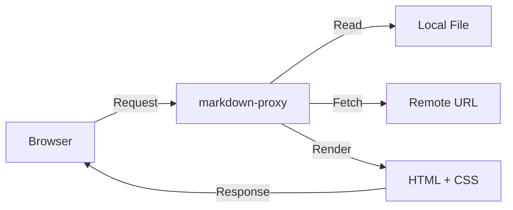
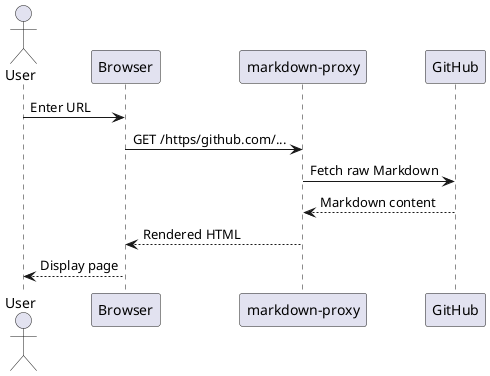

# markdown-proxy Demo

A lightweight HTTP proxy that renders Markdown in the browser — with diagrams, math, and syntax highlighting.

## Features at a Glance

| Feature | Description |
|---------|-------------|
| GFM Support | Tables, task lists, strikethrough, and more |
| Syntax Highlighting | Language-aware code coloring |
| Math Rendering | Inline and display math via KaTeX |
| Diagrams | Mermaid and PlantUML support |
| Themes | GitHub, Simple, and Dark themes |
| Live Reload | Auto-refresh on file save |

## Code Highlighting

```go
package main

import (
	"fmt"
	"net/http"
)

func main() {
	http.HandleFunc("/", func(w http.ResponseWriter, r *http.Request) {
		fmt.Fprintln(w, "Hello, markdown-proxy!")
	})
	http.ListenAndServe(":9080", nil)
}
```

## Math Rendering

Einstein's famous equation $E = mc^2$ is rendered inline.

Display math is also supported:

$$
\int_0^\infty e^{-x^2} dx = \frac{\sqrt{\pi}}{2}
$$

## Mermaid Diagram



## PlantUML Diagram


